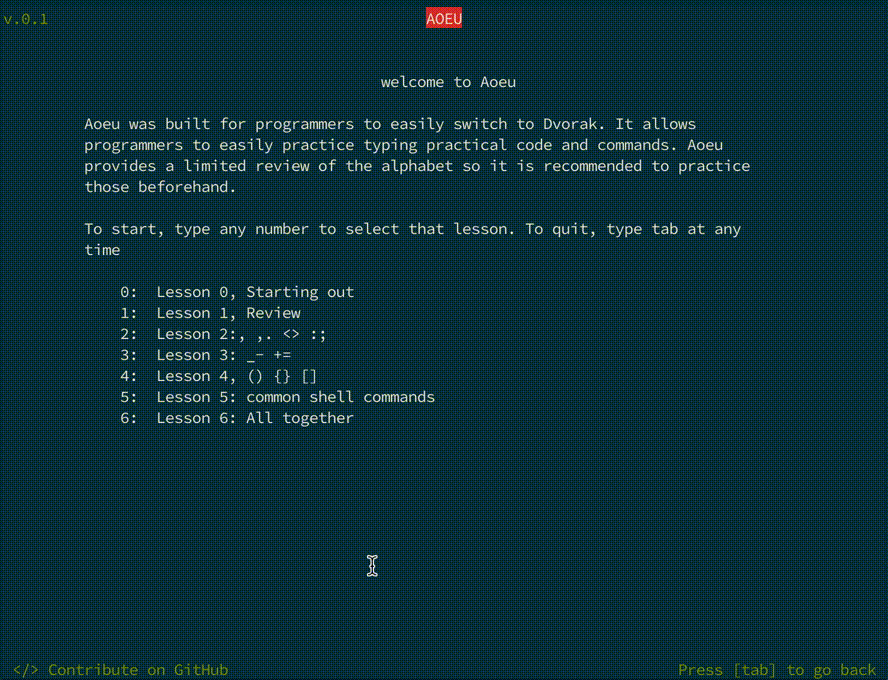

# Aoeu
## A terminal based Dvorak teaching application for programmers

Built to help programmers who want to switch to Dvorak quickly get up to speed with their new layout.

## Practice what is most important to programmers:
  * common shell commands,
  * common phrases and variables,
  * and more.

## Lessons built around typing tests for useful practice:

### Features
* Gradual difficulty scale
* 6 unique lessons and typing tests
* Post-lesson analysis screen

## Dependencies
* Python 3
* Curses
